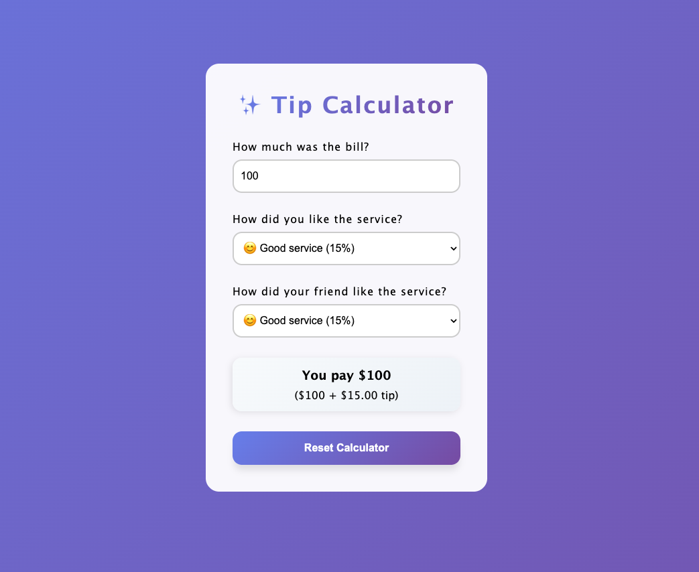

# 💸 Tip Calculator

A modern **tip calculator** built with React that helps you calculate tips based on both your opinion _and_ your friend's opinion of the service.

---

## ✨ Features

- Enter bill amount
- Rate service quality (you and your friend)
- Automatically averages both ratings for fair tipping
- Real-time calculation
- Clean, responsive design

---

## 🧠 How It Works

1. Input the **bill total**
2. Select **your** service rating (10–25%)
3. Select **your friend's** service rating (10–25%)
4. View the **total amount** including the averaged tip

---

## 🛠 Tech Stack

- React
- HTML / CSS
- JavaScript

---

> Perfect for splitting bills fairly when dining with friends!
